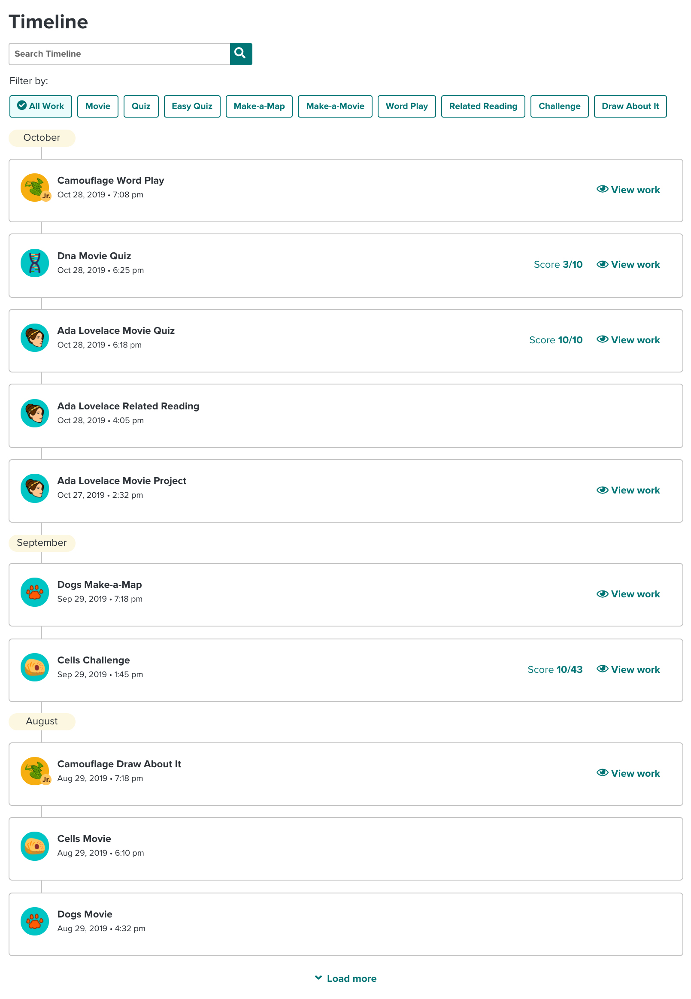

TABLE OF CONTENTS

<!-- @import "[TOC]" {cmd="toc" depthFrom=1 depthTo=6 orderedList=false} -->

<!-- code_chunk_output -->

- [Environment Setup](#environment-setup)
  - [Vue Client](#vue-client)
  - [Server](#server)
- [Assignment Details](#assignment-details)
- [Basic requirements:](#basic-requirements)
- [Advanced](#advanced)
- [APIs](#apis)
- [Screenshots](#screenshots)
  - [Activities view](#activities-view)
  - [Zoom](#zoom)
  - [Auto-complete](#auto-complete)
- [Activity Types and Settings](#activity-types-and-settings)

<!-- /code_chunk_output -->

# Environment Setup

## Vue Client

1. Navigate to your client folder: `cd {project folder}/client`
2. Install project dependencies: `npm install`
3. Run your dev server. `npm run serve`. Your dev server is ready at http://localhost:8080
   (The dev server defaults to port 8080. If it's taken and it uses a different one you'll need to update your cors settings in the server app.js)

## Server

1. Navigate to your server folder: `cd {project folder}/server`
2. Install project dependencies: `npm install`
3. Run your server. `npm start`. Your server is ready at http://localhost:3000

---

# Assignment Details

Your task is to build a student timeline app as shown in the [Activities view](#activities-view) screenshot. This timeline displays all the student's activities.
You can find the [Requirements](#requirements-guides), [Screenshots](#screenshots) and [APIs](#apis) below.
Note: The time this assignment will take to complete will differ based on experience.

# Basic requirements:

- This app contains one main view - the [Activities view](#activities-view).
- The main activities feed you should be using is the [Activities V1 API](#apis).
- When the user clicks on the 'View work' link on an activity, it should open a modal as seen on the [Zoom](#zoom) screenshot. This modal shows the activity info plus the teacher comment on that activity.
- The app should support direct access to the zoom view via your router.
- The activities timeline should be grouped and ordered by months as seen in the [Activities view](#activities-view) screenshot.
- Each activity has its own set of attributes that determine the way it is rendered. Available activities and their attributes are listed in the [Activity Types and Settings](#activity-types-and-settings) section.
- The app should support two types of filters:
  - Free text filter
  - Activity type filter
    No additional API calls are required for that, you already have all the data you need.
- There are two products variants. 'bp' and 'bpjr'. The product affects the topic icon rendering as seen in the [Activities view](#activities-view) screenshot.
- Design matters! Keep close to the design as it is shown in the screenshots.

# Advanced

- The app support another data feed, [Activities V2 API](#apis), that is structured differently. Same data, but a different structure. Make sure your code supports both structures from [API #V1](#apis) and [API #V2](#apis). Create a new route that demonstrates this support.
- The app should display 10 activities at a time and support pagination for loading additional ones in the form of a 'Load more' button.
- Add support for hiding activities. Every activity row should have a hide icon that hides it when clicked. This hidden state should be persistent.
- Add autosuggest support to the text filter input.
  Use the topics names from your main [API V1](#apis) feed to generate the autosuggest items list.

# APIs

- [Get activities - V1](http://localhost:3000/activities/v1)
- [Get activities - V2](http://localhost:3000/activities/v2)

# Screenshots

###Activities view

###Zoom

###Auto-complete

# Activity Types and Settings

Every activity has two settings. They can be scored and they can be viewed in zoom mode (View work button). Those settings are not a part of the API response but rather resides on the client app.

- **Movie**
  - Score = false
  - Zoom = false
- **Quiz**
  - Score = true
  - Zoom = true
- **Easy Quiz**
  - Score = true
  - Zoom = true
- **Challenge**
  - Score = true
  - Zoom = true
- **Make a Map**
  - Score = false
  - Zoom = true
- **Make a Movie**
  - Score = false
  - Zoom = true
- **Wordplay**
  - Score = false
  - Zoom = true
- **Related reading**
  - Score = false
  - Zoom = false
- **Draw about it**
  - Score = false
  - Zoom = true
"# BrainPOP" 
